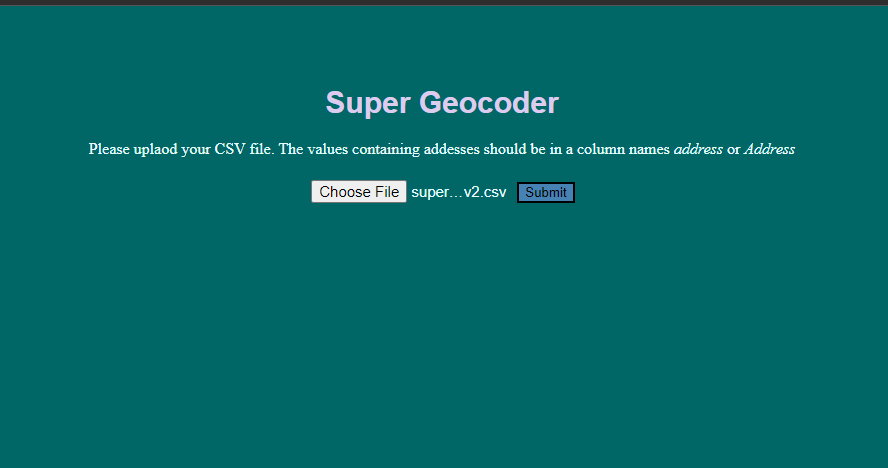
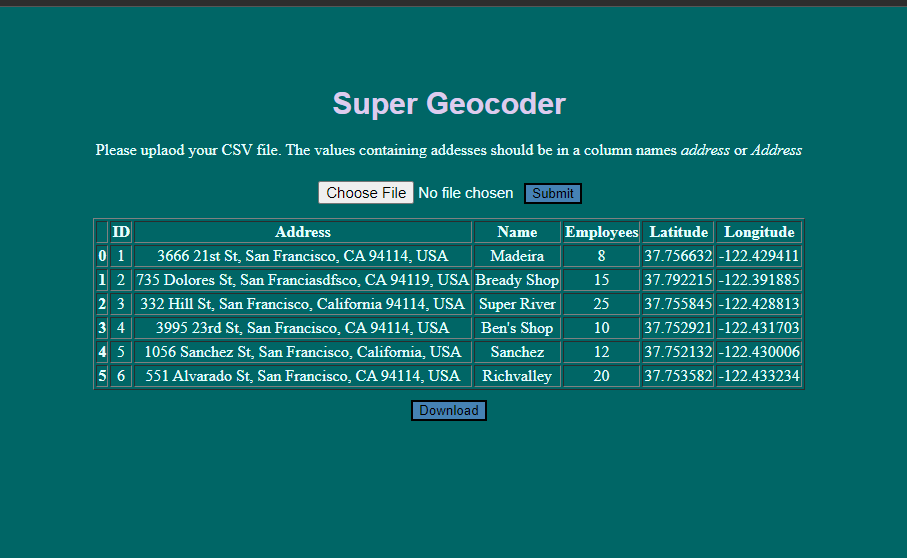

# Geocoder
This program takes a user submitted file containing addresses and updates the csv to contain the latitude and longitude of each address. 
The user can then download the updated file.

The main objective was to further excercise the use of Flask, geopy, pandas, html, and css.

